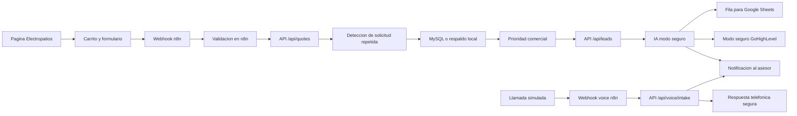

# Electropatios Quote Automation Platform

Proyecto de portafolio para practicar automatizacion, CRM, webhooks, n8n, MySQL, APIs REST e IA usando un caso realista: solicitudes de cotizacion para Electropatios.

Electropatios vende productos electricos como lamparas, conectores, cable, tuberia, breakers, tomacorrientes y accesorios. El sistema recibe solicitudes desde una pagina web, valida datos, clasifica la prioridad y deja todo listo para seguimiento.

## Que demuestra este proyecto

- Pagina web con formulario real de cotizacion.
- Pagina local completa con inicio, catalogo, servicios, preguntas y contacto.
- Catalogo con productos, categorias, buscador y pedido tipo carrito.
- API REST en Python para recibir solicitudes comerciales.
- Validacion de datos antes de guardar o automatizar.
- Clasificacion interna por prioridad: `high`, `medium` o `low`.
- Conversion de cotizaciones en leads comerciales.
- Fila preparada para Google Sheets.
- Modo seguro de GoHighLevel para preparar contactos y oportunidades sin enviar datos reales.
- IA en modo seguro para clasificar pedidos, aplicar guardrails y preparar handoff humano.
- Voice AI en modo seguro para simular llamadas, entender pedidos y preparar respuesta telefonica.
- Notificacion interna para pedidos urgentes.
- Catalogo base para futuras preguntas con IA.
- Persistencia en MySQL, con respaldo local si MySQL no esta disponible.
- Base lista para conectar n8n, Google Sheets, email, CRM y agentes IA.
- Documentacion para explicar arquitectura, errores y decisiones tecnicas en entrevista.

## Estructura

```text
electropatios-quote-system/
|-- backend/
|   |-- app.py
|   |-- ai_logic.py
|   |-- ghl_logic.py
|   |-- lead_logic.py
|   |-- quote_logic.py
|   |-- voice_logic.py
|   `-- tests/
|       |-- test_ai_logic.py
|       |-- test_ghl_logic.py
|       |-- test_lead_logic.py
|       |-- test_quote_logic.py
|       `-- test_voice_logic.py
|-- database/
|   `-- schema.sql
|-- examples/
|   `-- requests/
|-- docs/
|   |-- architecture.md
|   |-- api-guide.md
|   |-- ai-safe-mode-guide.md
|   |-- gohighlevel-safe-mode-guide.md
|   |-- lead-automation-guide.md
|   |-- n8n-guide.md
|   |-- voice-ai-safe-mode-guide.md
|   |-- wordpress-local-web-guide.md
|   |-- learning-roadmap.md
|   `-- workflows/
|       |-- quote-workflow.md
|       `-- voice-workflow.md
|-- frontend/
|   |-- index.html
|   |-- style.css
|   `-- script.js
|-- n8n/
|   |-- README.md
|   |-- electropatios-order-workflow.json
|   `-- electropatios-voice-workflow.json
|-- .env.example
`-- requirements.txt
```

## Como probar la primera version

1. Crear un entorno virtual de Python.
2. Instalar dependencias.
3. Copiar `.env.example` como `.env`.
4. Ejecutar la API.
5. Abrir `frontend/index.html` en el navegador.

```powershell
python -m venv .venv
.\.venv\Scripts\Activate.ps1
pip install -r requirements.txt
copy .env.example .env
python backend\app.py
```

La API queda disponible en:

```text
http://localhost:5000
```

El formulario envia solicitudes a:

```text
http://127.0.0.1:5678/webhook/electropatios-order
```

Tambien puedes consultar el catalogo base:

```text
http://localhost:5000/api/catalog
```

Para entender la API paso a paso, revisa:

```text
docs/api-guide.md
```

Para entender el primer workflow de n8n, revisa:

```text
docs/n8n-guide.md
```

Para entender como la cotizacion se convierte en lead, revisa:

```text
docs/lead-automation-guide.md
```

Para entender la preparacion segura de GoHighLevel, revisa:

```text
docs/gohighlevel-safe-mode-guide.md
```

Para entender la IA segura, revisa:

```text
docs/ai-safe-mode-guide.md
```

Para entender el agente telefonico seguro, revisa:

```text
docs/voice-ai-safe-mode-guide.md
```

Para entender la pagina local y como se relaciona con WordPress, revisa:

```text
docs/wordpress-local-web-guide.md
```

Cuando n8n este corriendo, su editor local queda en:

```text
http://localhost:5678
```

La instalacion local actual de n8n usa `npx`, version `2.33.5`, con datos en:

```text
C:\Users\deyso\.n8n
```

## Primer flujo objetivo



## Frase de portafolio

Construyo un sistema de automatizacion comercial para Electropatios con una pagina local completa donde un cliente arma pedidos de materiales electricos. La API valida campos, clasifica prioridad, crea un lead comercial, aplica IA segura con guardrails, simula llamadas con Voice AI y prepara sincronizacion CRM sin enviar datos reales.
