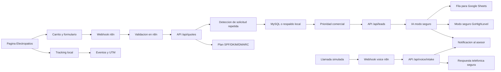

# Electropatios Quote Automation

Este es mi proyecto de portafolio para practicar automatizacion comercial con un caso realista: una pagina de Electropatios donde el cliente arma un pedido de materiales electricos y el sistema prepara el seguimiento.

Electropatios vende productos como lamparas, conectores, cable, tuberia, breakers, tomacorrientes y accesorios. La idea fue construir una sola base de proyecto para aprender Git/GitHub, API, n8n, CRM, IA segura, Voice AI, tracking, email infrastructure y deploy.

## Demo online

```text
https://deyson24ivan.github.io/electropatios-quote-system/
```

La demo online muestra la pagina y el flujo de carrito/formulario. Como GitHub Pages no ejecuta Flask ni n8n, online uso un modo demo seguro. En mi computador, el mismo frontend puede enviar pedidos al webhook local de n8n.

## Que construi

- Pagina web con formulario real de cotizacion.
- Pagina local completa con inicio, catalogo, servicios, preguntas y contacto.
- Catalogo con productos, categorias, buscador y pedido tipo carrito.
- API REST en Python para recibir solicitudes comerciales.
- Validacion de datos antes de guardar o automatizar.
- Clasificacion interna por prioridad: `high`, `medium` o `low`.
- Conversion de cotizaciones en leads comerciales.
- Fila preparada para Google Sheets.
- Modo seguro de GoHighLevel para preparar contactos y oportunidades sin enviar datos reales.
- IA en modo seguro para clasificar pedidos, aplicar guardrails y preparar handoff humano.
- Voice AI en modo seguro para simular llamadas, entender pedidos y preparar respuesta telefonica.
- Tracking local con eventos, UTM y conversiones antes de conectar Analytics real.
- Infraestructura email en modo seguro para preparar SPF, DKIM, DMARC y entregabilidad.
- Deploy de portafolio con GitHub Pages desde la rama `main`.
- Mapa de codigo y guia de portafolio para repasar el proyecto.
- Notificacion interna para pedidos urgentes.
- Catalogo base para futuras preguntas con IA.
- Persistencia en MySQL, con respaldo local si MySQL no esta disponible.
- Base lista para conectar n8n, Google Sheets, email, CRM y agentes IA.
- Documentacion para explicar arquitectura, errores y decisiones tecnicas en entrevista.

## Estructura

```text
electropatios-quote-system/
|-- index.html
|-- .nojekyll
|-- backend/
|   |-- app.py
|   |-- ai_logic.py
|   |-- email_logic.py
|   |-- ghl_logic.py
|   |-- lead_logic.py
|   |-- quote_logic.py
|   |-- tracking_logic.py
|   |-- voice_logic.py
|   `-- tests/
|       |-- test_ai_logic.py
|       |-- test_email_logic.py
|       |-- test_ghl_logic.py
|       |-- test_lead_logic.py
|       |-- test_quote_logic.py
|       |-- test_tracking_logic.py
|       `-- test_voice_logic.py
|-- database/
|   `-- schema.sql
|-- examples/
|   `-- requests/
|-- docs/
|   |-- architecture.md
|   |-- deploy-guide.md
|   |-- api-guide.md
|   |-- ai-safe-mode-guide.md
|   |-- code-walkthrough.md
|   |-- gohighlevel-safe-mode-guide.md
|   |-- email-infrastructure-guide.md
|   |-- lead-automation-guide.md
|   |-- n8n-guide.md
|   |-- portfolio-guide.md
|   |-- tracking-guide.md
|   |-- voice-ai-safe-mode-guide.md
|   |-- wordpress-local-web-guide.md
|   |-- learning-roadmap.md
|   `-- workflows/
|       |-- quote-workflow.md
|       `-- voice-workflow.md
|-- frontend/
|   |-- index.html
|   |-- style.css
|   |-- tracking.js
|   `-- script.js
|-- n8n/
|   |-- README.md
|   |-- electropatios-order-workflow.json
|   `-- electropatios-voice-workflow.json
|-- .env.example
`-- requirements.txt
```

## Como probarlo localmente

1. Crear un entorno virtual de Python.
2. Instalar dependencias.
3. Copiar `.env.example` como `.env`.
4. Ejecutar la API.
5. Abrir `frontend/index.html` en el navegador.

```powershell
python -m venv .venv
.\.venv\Scripts\Activate.ps1
pip install -r requirements.txt
copy .env.example .env
python backend\app.py
```

La API queda disponible en:

```text
http://localhost:5000
```

El formulario envia solicitudes a:

```text
http://127.0.0.1:5678/webhook/electropatios-order
```

Tambien puedes consultar el catalogo base:

```text
http://localhost:5000/api/catalog
```

## Guias para repasar

Para entender la API paso a paso, revisa:

```text
docs/api-guide.md
```

Para entender el primer workflow de n8n, revisa:

```text
docs/n8n-guide.md
```

Para entender como la cotizacion se convierte en lead, revisa:

```text
docs/lead-automation-guide.md
```

Para entender la preparacion segura de GoHighLevel, revisa:

```text
docs/gohighlevel-safe-mode-guide.md
```

Para entender la IA segura, revisa:

```text
docs/ai-safe-mode-guide.md
```

Para entender el agente telefonico seguro, revisa:

```text
docs/voice-ai-safe-mode-guide.md
```

Para entender tracking, UTM, Analytics y Pixel, revisa:

```text
docs/tracking-guide.md
```

Para entender SPF, DKIM, DMARC y entregabilidad, revisa:

```text
docs/email-infrastructure-guide.md
```

Para entender el deploy de portafolio con GitHub Pages, revisa:

```text
docs/deploy-guide.md
```

Para repasar el codigo archivo por archivo, revisa:

```text
docs/code-walkthrough.md
```

Para preparar la explicacion de entrevista, revisa:

```text
docs/portfolio-guide.md
```

Para entender la pagina local y como se relaciona con WordPress, revisa:

```text
docs/wordpress-local-web-guide.md
```

Cuando n8n este corriendo, su editor local queda en:

```text
http://localhost:5678
```

La instalacion local actual de n8n usa `npx`, version `2.33.5`, con datos en:

```text
C:\Users\deyso\.n8n
```

La pagina de portafolio se publica con GitHub Pages desde `main / root`. El archivo raiz `index.html` abre la pagina real de `frontend/`.

```text
https://deyson24ivan.github.io/electropatios-quote-system/
```

## Primer flujo objetivo



## Como lo explico rapido

Construi un sistema de automatizacion comercial para Electropatios. La pagina permite armar pedidos de materiales electricos, la API valida y clasifica la solicitud, n8n orquesta el flujo, el backend crea leads, prepara CRM/Sheets/notificaciones, aplica IA y voz en modo seguro, registra tracking local, genera un plan SPF/DKIM/DMARC y publica una demo online en GitHub Pages.

## Estado actual

Las 12 fases del proyecto estan cerradas como version de aprendizaje y portafolio. Lo que falta para un trabajo real seria subir API/n8n/base de datos a servidores, conectar credenciales reales y activar dominio, CRM, email y tracking reales.
