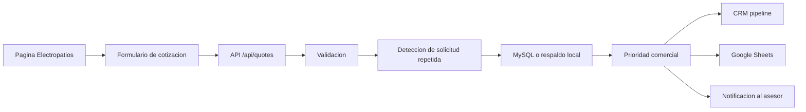

# Electropatios Quote Automation Platform

Proyecto de portafolio para practicar automatizacion, CRM, webhooks, n8n, MySQL, APIs REST e IA usando un caso realista: solicitudes de cotizacion para Electropatios.

Electropatios vende productos electricos como lamparas, conectores, cable, tuberia, breakers, tomacorrientes y accesorios. El sistema recibe solicitudes desde una pagina web, valida datos, clasifica la prioridad y deja todo listo para seguimiento.

## Que demuestra este proyecto

- Pagina web con formulario real de cotizacion.
- Catalogo con productos, categorias, buscador y pedido tipo carrito.
- API REST en Python para recibir solicitudes comerciales.
- Validacion de datos antes de guardar o automatizar.
- Clasificacion interna por prioridad: `high`, `medium` o `low`.
- Catalogo base para futuras preguntas con IA.
- Persistencia en MySQL, con respaldo local si MySQL no esta disponible.
- Base lista para conectar n8n, Google Sheets, email, CRM y agentes IA.
- Documentacion para explicar arquitectura, errores y decisiones tecnicas en entrevista.

## Estructura

```text
electropatios-quote-system/
|-- backend/
|   |-- app.py
|   |-- quote_logic.py
|   `-- tests/
|       `-- test_quote_logic.py
|-- database/
|   `-- schema.sql
|-- examples/
|   `-- requests/
|-- docs/
|   |-- architecture.md
|   |-- api-guide.md
|   |-- learning-roadmap.md
|   `-- workflows/
|       `-- quote-workflow.md
|-- frontend/
|   |-- index.html
|   |-- style.css
|   `-- script.js
|-- n8n/
|   |-- README.md
|   `-- quote-workflow.sample.json
|-- .env.example
`-- requirements.txt
```

## Como probar la primera version

1. Crear un entorno virtual de Python.
2. Instalar dependencias.
3. Copiar `.env.example` como `.env`.
4. Ejecutar la API.
5. Abrir `frontend/index.html` en el navegador.

```powershell
python -m venv .venv
.\.venv\Scripts\Activate.ps1
pip install -r requirements.txt
copy .env.example .env
python backend\app.py
```

La API queda disponible en:

```text
http://localhost:5000
```

El formulario envia solicitudes a:

```text
http://localhost:5000/api/quotes
```

Tambien puedes consultar el catalogo base:

```text
http://localhost:5000/api/catalog
```

Para entender la API paso a paso, revisa:

```text
docs/api-guide.md
```

## Primer flujo objetivo



## Frase de portafolio

Construyo un sistema de automatizacion comercial para Electropatios donde un cliente solicita cotizaciones de materiales electricos, la API valida campos, clasifica la prioridad, evita solicitudes repetidas, registra la informacion y deja la base lista para integrarse con n8n, CRM, Google Sheets, email e IA.
