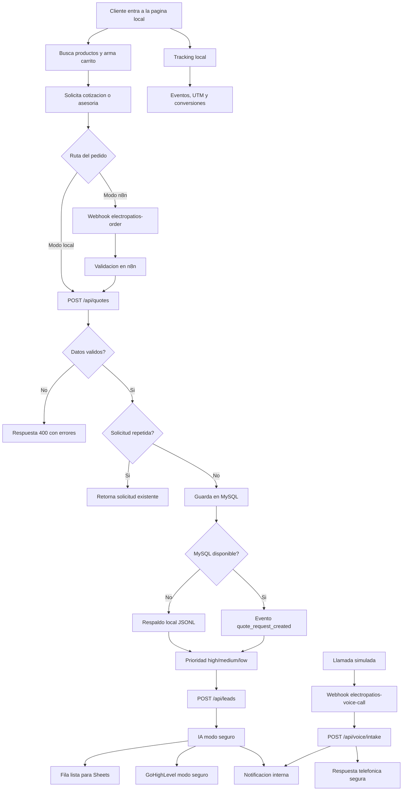

# Arquitectura

Este proyecto esta disenado como una plataforma de cotizaciones para Electropatios. La pagina recibe pedidos reales de productos electricos, n8n orquesta el flujo y la API guarda cotizaciones, leads y notificaciones.

## Flujo principal



## Contrato de datos

```json
{
  "full_name": "Ana Perez",
  "email": "ana@example.com",
  "phone": "+573001234567",
  "customer_type": "empresa",
  "company_name": "Proyecto Norte",
  "request_type": "quote",
  "product_category": "cable",
  "quantity": 150,
  "unit": "metro",
  "budget_cop": 2500000,
  "urgency": "hoy",
  "delivery_city": "Cucuta",
  "notes": "Necesito cable #12 y disponibilidad para hoy",
  "consent": true
}
```

## Reglas iniciales

- Validar nombre, email, telefono, categoria de producto, cantidad para cotizaciones y consentimiento.
- Permitir que un mismo cliente haga varias cotizaciones distintas.
- Detectar repetidos por huella de solicitud: cliente, categoria, cantidad, unidad, ciudad y detalle.
- Clasificar como `high` si hay urgencia, volumen alto, presupuesto alto o cliente empresarial.
- Clasificar como `medium` si hay potencial comercial pero falta confirmar precio, disponibilidad o entrega.
- Clasificar como `low` si es una pregunta inicial que requiere asesoria o seguimiento posterior.
- Si MySQL falla, guardar respaldo local y registrar el error.
- Convertir la cotizacion en lead comercial para seguimiento.
- Preparar datos para Sheets y GoHighLevel sin enviar datos reales todavia.
- Clasificar intencion con IA segura y pasar a asesor cuando falte informacion confirmada.
- Simular llamadas telefonicas desde una transcripcion y preparar una respuesta segura para el cliente.
- No confirmar precios, stock, entregas ni recomendaciones electricas tecnicas durante una llamada automatizada.
- Mantener una pagina local completa con catalogo, carrito, formulario, servicios, preguntas y contacto.
- Medir eventos de pagina y UTM en modo local antes de conectar Analytics real.

## Catalogo base

La API expone `GET /api/catalog` con categorias iniciales:

- Lamparas.
- Conectores.
- Cable.
- Tuberia.
- Breakers, tableros, tomacorrientes e interruptores.
- Herramientas y accesorios.

## Guardrails para IA

El agente IA no debe inventar precios, disponibilidad o marcas. Debe responder solo con informacion disponible en catalogo, inventario o reglas cargadas.

Si el cliente pregunta algo que no esta documentado, la respuesta esperada es:

> No tengo esa informacion confirmada. Puedo registrar la pregunta para que un asesor de Electropatios la revise.

Esta regla es importante para explicar en entrevista como se reducen alucinaciones.

## Voice AI en modo seguro

El agente telefonico de esta fase no hace llamadas reales. Recibe una transcripcion por JSON, detecta si el cliente quiere cotizar, preguntar disponibilidad o pedir asesoria tecnica, y prepara una respuesta corta para telefono.

Lo importante de esta fase es aprender el flujo:

1. Entra una llamada o transcripcion.
2. n8n valida que exista texto.
3. La API clasifica intencion, producto, cantidad, urgencia y prioridad.
4. La API prepara una respuesta segura.
5. Si hace falta asesor, se guarda una notificacion interna.

Cuando exista proveedor real, esta misma estructura se puede conectar a Twilio, GoHighLevel Phone, ElevenLabs o un modelo de voz.

## Tracking local

El tracking local mide acciones importantes de la pagina sin conectar herramientas externas todavia.

Eventos actuales:

- `page_view`
- `catalog_search`
- `category_filter`
- `product_add`
- `cart_open`
- `cart_clear`
- `quote_submit_attempt`
- `quote_submit_success`
- `quote_submit_error`

La pagina lee UTM desde la URL y los manda con cada evento. Tambien agrega la fuente al pedido para que el lead pueda saber si vino de Facebook, Google, WhatsApp o una prueba local.
